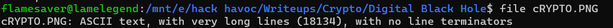

## Digital Black Hole
### Category: CRYPTO
### Points: 40
### Description
Imagine a digital black hole where secrets vanish into thin air. We've cast a cryptic message into this void, one that only the most adept machines can decipher

### Approach
The given file has format error, so we try doing files on the file to see the type of data it has.

So we can make that a .txt file

converting all the binary numbers to decimal then to characters, we get another series of binary numbers
 Doing the entire process again, this time we get another series of binary numbers, which when converted to characters we get `8SNZ9Rn1LCYmWnr5DVLcyhZ` which when put in [dcode](https://www.dcode.fr/cipher-identifier) we find its base62 encoded now we put in cyberchef, we get the flag 

#### Flag: CM{N0t_64_Alway5}

