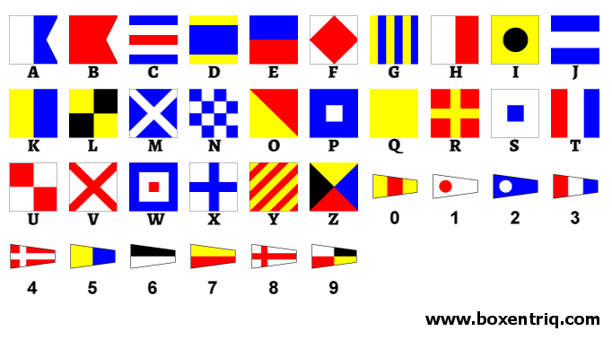

## Green Flags 🟢
### Category: CRYPTO
### Points: 20
### Description
Flag Frenzy In a sea of encrypted flags, your mission is to unravel the chaos and reveal the hidden truth.

Flag : CM{abcd_abcdefgh}

### Approach
Seeing the image we can figure out that its mostly flag cipher. From an online image, if we decrypt the given image get the flag(just make sure it follows the order and case mentioned in the challenge)

#### Flag: CM{nato_signals}

