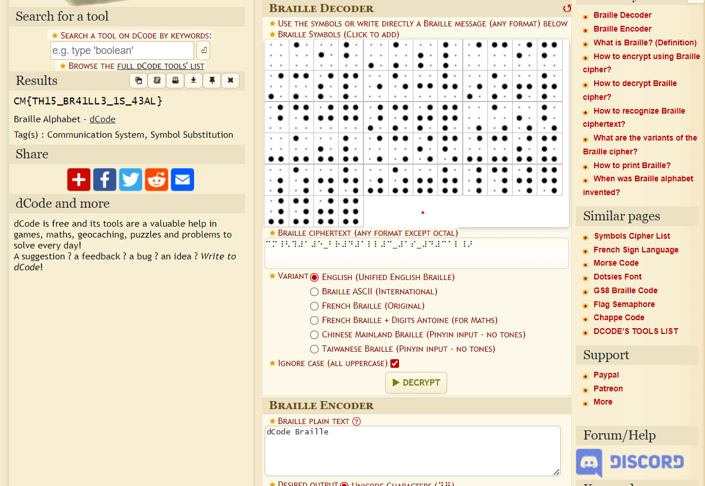

## The Key to Nowhere
### Category: CRYPTO
### Points: 30
### Description
In the land of secrets, where the ordinary becomes extraordinary, there’s a riddle that loves to play hide-and-seek. It's hiding in plain sight, yet elusive to the eye. Venture into the realm where invisible ink holds the clues, and remember

### Approach
On opening the given file we can clearly see it's in Braille, so we just use an online [braille reader](https://www.dcode.fr/braille-alphabet) to get the flag

#### Flag: CM{TH15_BR41LL3_1S_43AL}

