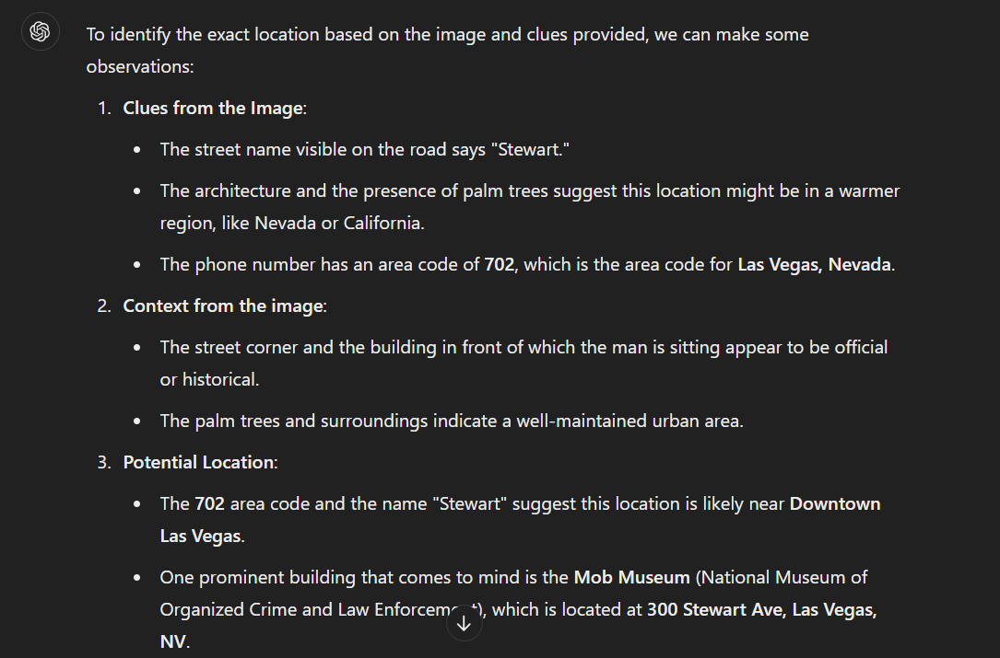

## Catch me !!!
### Category: OSINT
### Points: 50
### Description
We’ve got a hot case for you! A beggar on the street is actually a member of Al Capone's mob, and the FBI needs your help to track him down—fast.

We've intercepted a suspicious phone number that seems to be connected to this individual—702.724.86XX. However, two digits are missing. se this along with the provided image and other clues to identify his exact location.

Report back the name of the building infront of which he is sitting flag format CM{abc_abc_abcdefg}

### Approach
On giving the image along with the description of the challenge to ChatGPT and it gives 
Here we can clearly see that it tells something about `The Mob Museum`, searching on the internet for such, does prove that there is a resemblence, however we can't be sure that it is the place we are looking for. Fortunately, when we try using this place as the flag, it works.
#### Flag: CM{the_mob_museum}

