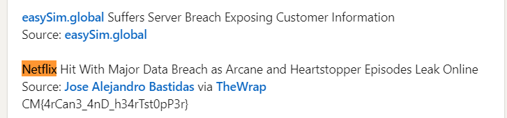

## CyberMaterial’s Cyber-Sleuth Newsletter
### Category: OSINT
### Points: 20
### Description
This month, there was an incident, and CyberMaterial is fast in publishing the newsletter, as you know. A Hacker leaked unreleased Netflix content, with Netflix hit by a major data breach as episodes of Arcane and Heartstopper leaked online.

But wait, they got the scoop before anyone even knew about the hack? 🧐

Let's see if you caught that.

### Approach
As the description looked like it was talking about some really important stuff, our first priorities will be look in linkedin and twitter. After some search of the word `netflix`, we arrive at a post

So there is our flag
#### Flag: CM{4rCan3_4nD_h34rTst0pP3r}

