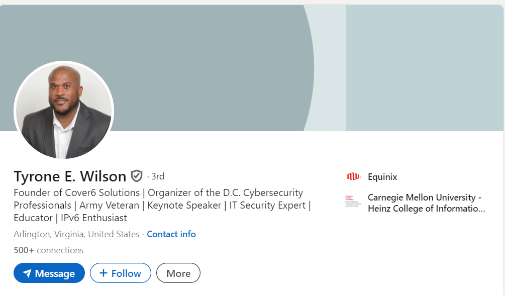
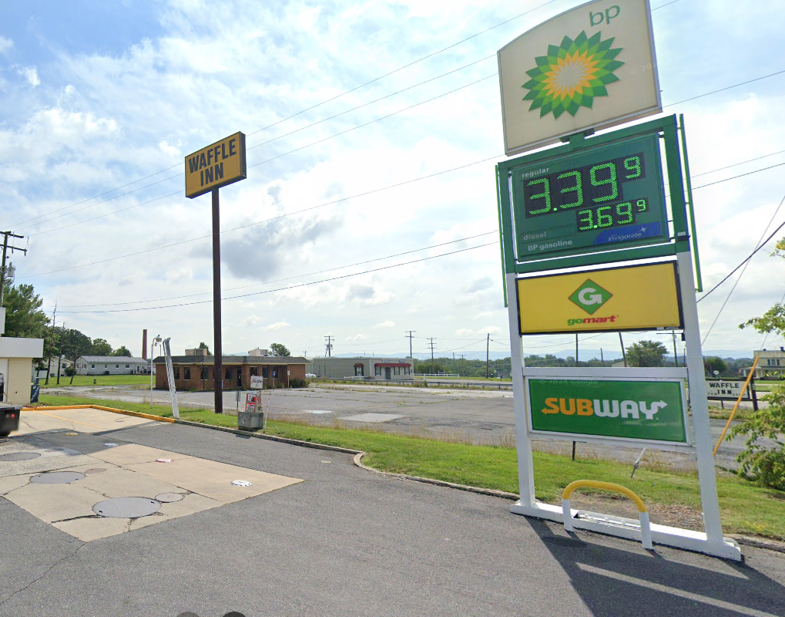
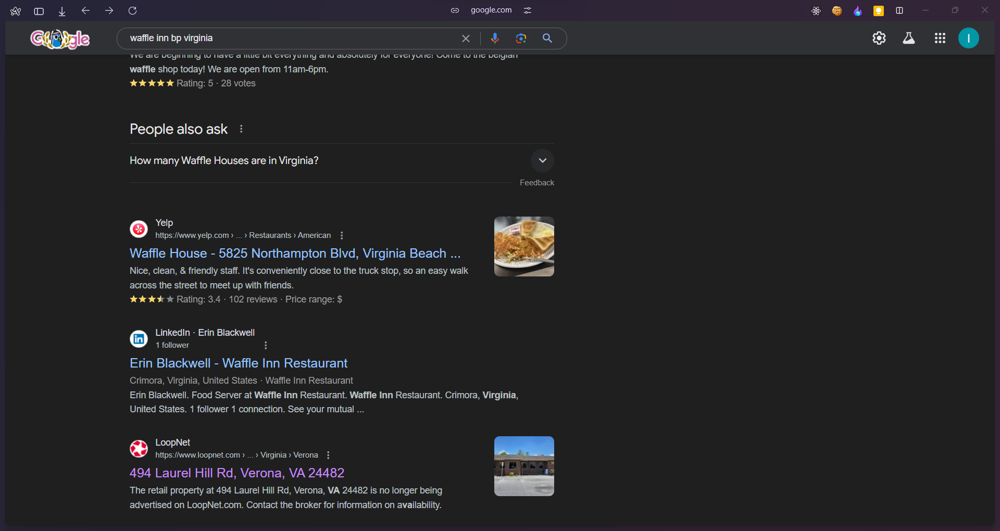

## Meet me here !
### Category: OSINT
### Points: 30
### Description
You have received an exclusive invitation to a secret CyberMaterial party. The invitation includes a single photo. The message reads, "Can't wait to see you there! Bring your best detective skills. Don't be late!"

Flag Format: CM{6_4_2} Digit means no. of letters in the word together CM{abcdef_abcd_ab} .

### Approach
If we google the name on the shirt of the guy who is in the pic, and go to their [LinkedIn page](https://www.linkedin.com/company/cover6-solutions-llc/posts/?feedView=all) we can find that guy easily and we can find out his address 

Searching for `Waffle INN` and `Subways` in arlington didnt really take anywhere. However from the hint in discord

If we search

Searching for this place on google earth we find [this](https://www.google.com/maps/@38.1915658,-78.9924027,3a,75y,64.49h,96.07t/data=!3m7!1e1!3m5!1sXjg-PklkuzxLF4w2NSX2SQ!2e0!6shttps:%2F%2Fstreetviewpixels-pa.googleapis.com%2Fv1%2Fthumbnail%3Fcb_client%3Dmaps_sv.tactile%26w%3D900%26h%3D600%26pitch%3D-6.06963675666816%26panoid%3DXjg-PklkuzxLF4w2NSX2SQ%26yaw%3D64.49251343173015!7i16384!8i8192?coh=205410&entry=ttu&g_ep=EgoyMDI0MDkwNC4wIKXMDSoASAFQAw%3D%3D)
this looks like the one in hint.
so following the format of the flag we get the flag.
#### Flag: CM{laurel_hill_rd}

