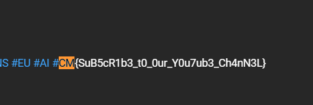

## Oops! Where Did I Hide the Flag?
### Category: OSINT
### Points: 60
### Description
Oops! In the midst of creating this OSINT challenge, I might’ve forgotten where I hid the flag in a video post. I remember it was about some interesting news, alerts, and incidents—so many things. Who knew social media could be so… forgettable? 😅

Put on your detective hat, dive into the social media jungle, and show me you can find what even I forgot! 🕵️‍♂️💡

### Approach
As it is mentioned that the flag is in a video post, the first priority will be youtube. So we go through the recent videos and do control+F to search for the flag.
Eventually in this [video](https://www.youtube.com/watch?v=iM4vtqkhmIo) we find the flag in the description.

#### Flag: CM{SuB5cR1b3_t0_0ur_Y0u7ub3_Ch4nN3L}

