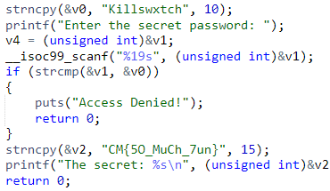

## Go Crazy!
### Category: REV
### Points: 30
### Description
In a small, dimly lit room, a determined hacker named killswxtch sits in front of an old, flickering computer screen. They find a book with a note that reads, "Check the sequence." Using this clue, killswxtch deciphers the password and enters it, unlocking a hidden door that reveals secret manuscripts.

### Approach
Again as it is just a 30 points challenge, there is a high chance we can find the flag in the strings of the attached file. But its not there, so we try decompiling it in [dogbolt.org](https://dogbolt.org/?id=ab7c86c4-793e-4069-9eeb-10dc8014fc74) and scroll down and then we get the flag

#### Flag: CM{5O_MuCh_7un}

