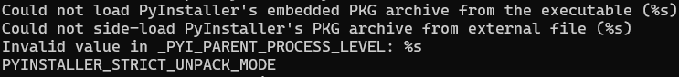
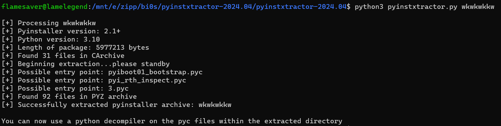
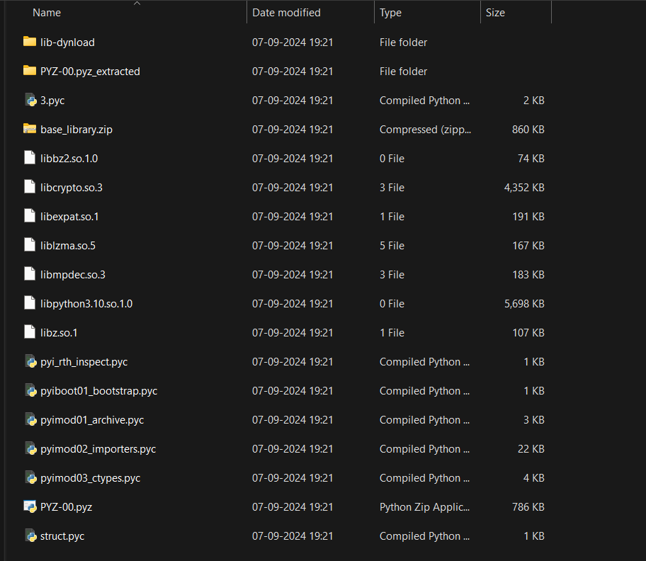
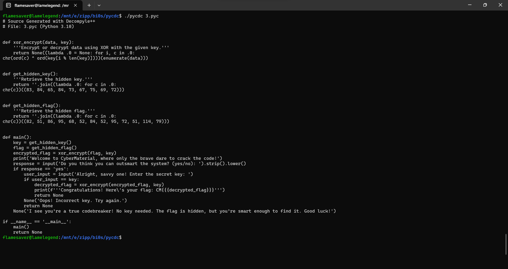

## The Key to Nowhere
### Category: REV
### Points: 60
### Description
You’ve got your hands on a mysterious file called wkwkwkkw, and the word on the street is that only those with a sharp mind and a good sense of humor can unlock its secrets. Legend says it holds the key to something... static, perhaps? Who knows?


### Approach
At first we can see the file is too big to put in **dogbolt**, so we see the strings of the file</br></br>
</br></br>
Going through that we see something called [Pyinstaller](https://github.com/pyinstaller), so we can figure out its somehow related to the challenge.</br>
Searching about it over the net we come across [Pyinstxtractor](https://github.com/extremecoders-re/pyinstxtractor)
Using this we can extract a bunch of stuff(in the folder wkwkwkkw_extracted) from the given file. </br></br>



So going through the extracted files, the file **3.pyc** looks very out of place. From past experiences with .pyc files, i used the tool [pycdc](https://github.com/zrax/pycdc) to extract the python code from it.</br></br>
</br>

```
def xor_encrypt(data, key):
    '''Encrypt or decrypt data using XOR with the given key.'''
    return None((lambda .0 = None: for i, c in .0:
chr(ord(c) ^ ord(key[i % len(key)])))(enumerate(data)))


def get_hidden_key():
    '''Retrieve the hidden key.'''
    return ''.join((lambda .0: for c in .0:
chr(c))((83, 84, 65, 84, 73, 67, 75, 69, 72)))


def get_hidden_flag():
    '''Retrieve the hidden flag.'''
    return ''.join((lambda .0: for c in .0:
chr(c))((82, 51, 86, 95, 68, 52, 84, 52, 95, 72, 51, 114, 79)))


def main():
    key = get_hidden_key()
    flag = get_hidden_flag()
    encrypted_flag = xor_encrypt(flag, key)
    print('Welcome to CyberMaterial, where only the brave dare to crack the code!')
    response = input('Do you think you can outsmart the system? (yes/no): ').strip().lower()
    if response == 'yes':
        user_input = input('Alright, savvy one! Enter the secret key: ')
        if user_input == key:
            decrypted_flag = xor_encrypt(encrypted_flag, key)
            print(f'''Congratulations! Here\'s your flag: CM{{{decrypted_flag}}}''')
            return None
        None('Oops! Incorrect key. Try again.')
        return None
    None('I see you’re a true codebreaker! No key needed. The flag is hidden, but you’re smart enough to find it. Good luck!')

if __name__ == '__main__':
    main()
    return None
```

So this is the code we get, going through it we can see that the flag is just the output of get_hidden_key(), so we use the solve script and get the flag `R3V_D4T4_H3rO`
#### Flag: CM{R3V_D4T4_H3rO}

