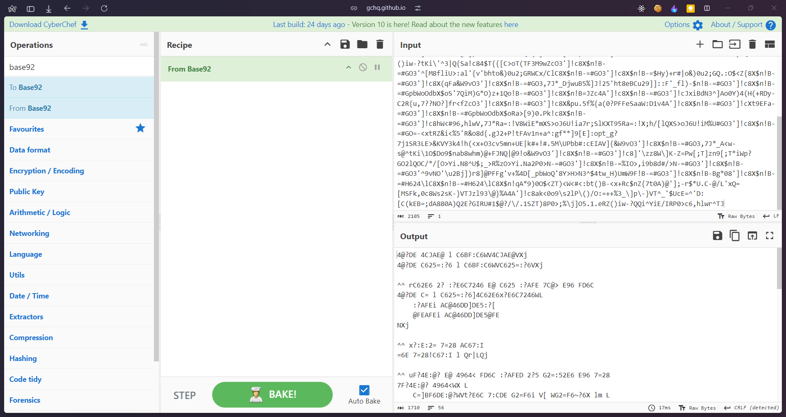
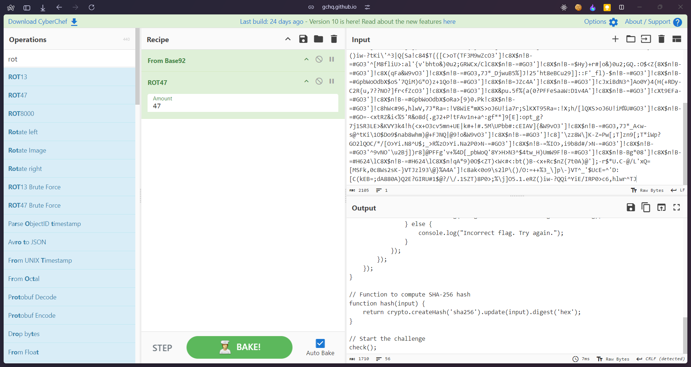

## Who's Really Dunked?
### Category: REV
### Points: 40
### Description
Cosmicgurl::92 says, "R47RoO7::47 is drunk!" 🍻 R47RoO7::47 responds, "JavaScript::00 is drunk!" 🤪 And then, out of nowhere, JavaScript stumbles in and says, "Yep, I'm actually drunk!" 🍹

So, let’s do a reverse cosmic dance to figure out who’s really had one too many. Spoiler alert: it looks like JavaScript is the real party animal! 🚀🥳


### Approach
Looking at the attached text we can see its a ciphered text, so put it in [dcode](https://www.dcode.fr/cipher-identifier) and get to know its base92 encoded</br></br>
</br></br>
After doing so we dont any proper string, so we can consider its another ciphered text so we put it in dcode again, we find out its Rot47 ciphered and decrypting it, we get proper decrypted text which is basically a js snippet.</br></br>


Going through the code, we can clearly figure out the 3 parts of the flag 
```if (valueOne === "News") {
                    flag += "News_";
                }

                if (valueTwo === "Alerts") {
                    flag += "Alerts_";
                }

                if (valueThree === "Incident") {
                    flag += "Incident";
                }
```

#### Flag: CM{News_Alerts_Incident}

