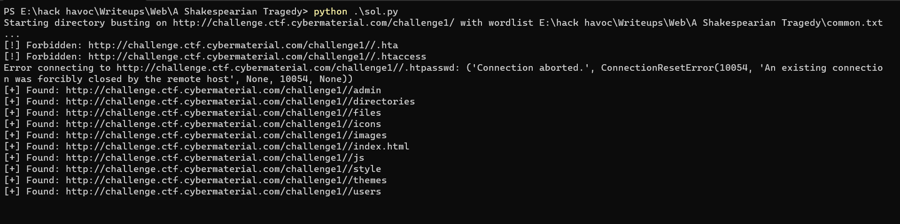

## A Shakespearian Tragedy
### Category: WEB
### Points: 40
### Description
“Now let it work. Mischief, thou art afoot. Take thou what course thou wilt” -Mark Antony

http://challenge.ctf.cybermaterial.com/challenge1/

### Approach
Opening the given website that was given, we dont really find anything useful. Moreover trying to find a robos.txt file alo doesnt work. So after randomly trying for directory [/admin](http://challenge.ctf.cybermaterial.com/challenge1/admin/), we see something as wrong door, so maybe there is some directory which is the right door.  

We find the above directories using the solve script to directory brute force with this [wordlist](https://github.com/danielmiessler/SecLists/blob/master/Discovery/Web-Content/common.txt), however none of the directories has anything useful, some of them (admin, directories, icons, themes, users) have wrong door. It was quite obvious that they have something to do with the flag. Going through their source code we find `h67GnLsMv4MWc84cYr2Ar6VZ7VrEc1VoGMFp3N` this ciphered text in [/users](http://challenge.ctf.cybermaterial.com/challenge1/users/)

Putting it in [dcode](https://www.dcode.fr/cipher-identifier) we get to know it is base58 encoded so we decode it and get `C3Mr{3id_}c4me_i_s4w_i_c0nqu`, we can see that flag is little messed but its pretty easy at this point
#### Flag: CM{i_c4me_i_s4w_i_c0nqu3r3d}

