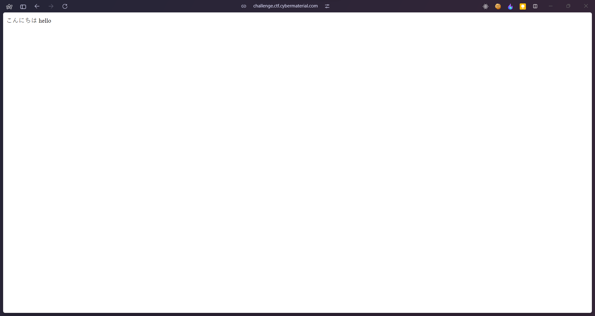

## Bidden Funhouse
### Category: WEB
### Points: 60
Seems like you're hitting a wall. But walls can have cracks, right? Find a way past the barricade and see if you can decode what's been hidden inside. Good luck!

http://challenge.ctf.cybermaterial.com/b/

### Approach
Upon opening the given website, and giving input, we see that the website redirection after submission of the form is not right, so we fix that and see this page

its just a simple static page. However there isa high chance the form in the given website is vulnerable to something like SQLi, XSS, SSTI, etc.
Trying out different payloads here and there, we come across this [repo](https://github.com/payloadbox/ssti-payloads), using the payload `{{config.items()}}`, we are redirected [here](http://challenge.ctf.cybermaterial.com/b/?name={{config.items()}}) where we get our flag.
#### Flag: CM{Y0u_4r3_a_r3A1Ly_go0D_nINj4}

