## The Shell Shocker
### Category: WEB
### Points: 80
Our CyberMaterial developer thought they’d created the ultimate basic Linux shell, only the essentials, nothing fancy. But we think they might have missed a trick or two. 😏

Your task? See if you can get this shell to do something it wasn’t exactly “designed” to do. Think of it like asking a fish to climb a tree. 🌳🐟

http://challenge.ctf.cybermaterial.com/a/

### Approach
Opening the given website, we find that it is not able to load `style.css` and `script.js` as it is not getting url decoded,
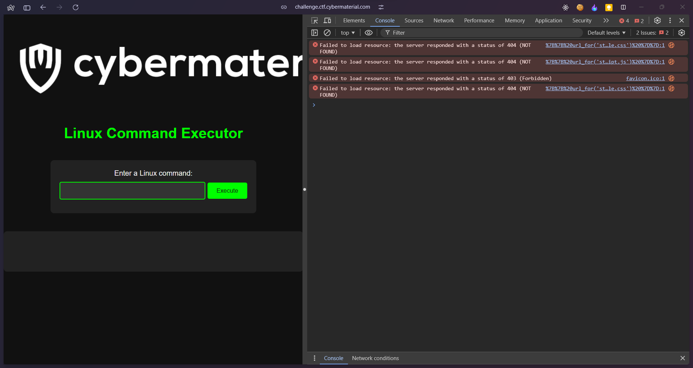
so we open burp suite and send such requests manually using proxy
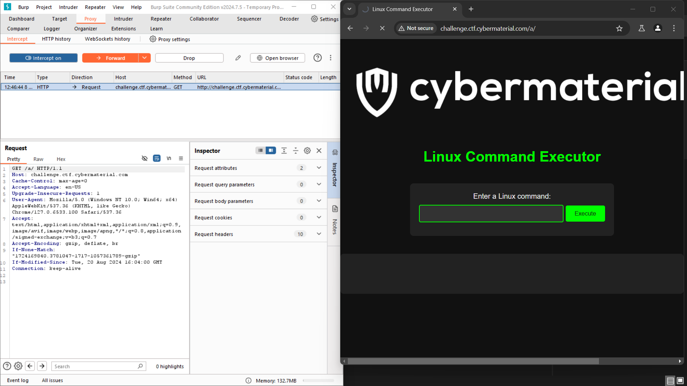
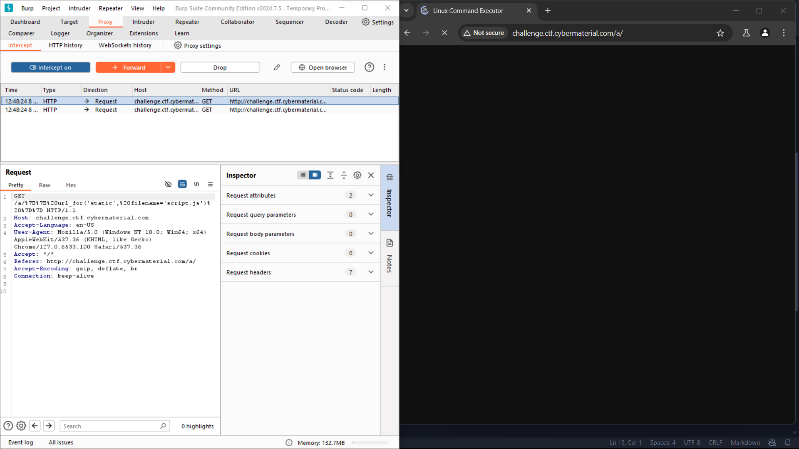
As we can see this url is not the right one 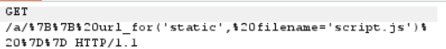
So we change this to the following
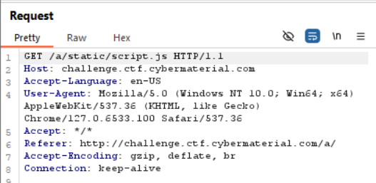
And we do that for `style.css` as well
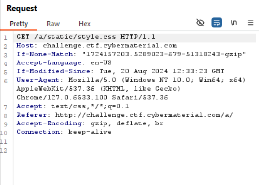
Now we try doing `cat flag.txt` but it says invalid command, means we need to intercept the request again
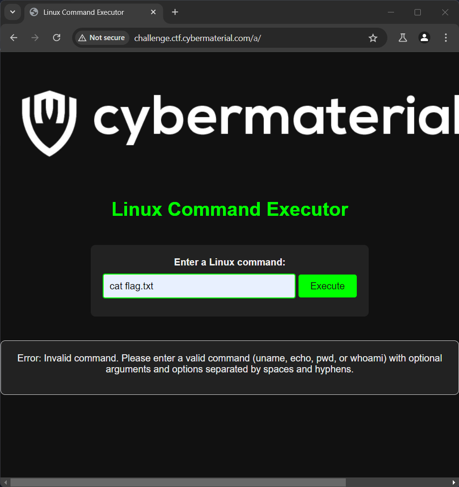

So now we change the `command` to `cat flag.txt` when we intercept the request to execute `uname` 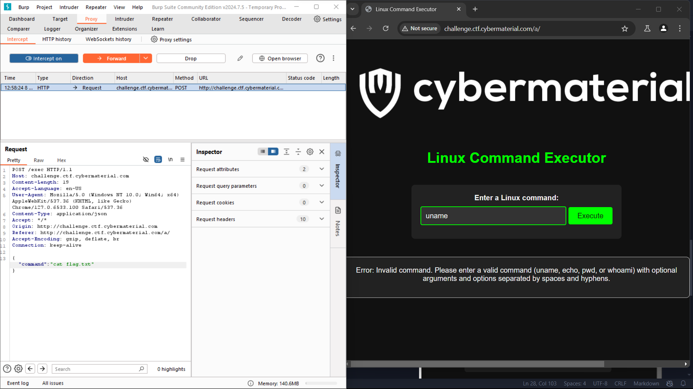
However it doesnt work
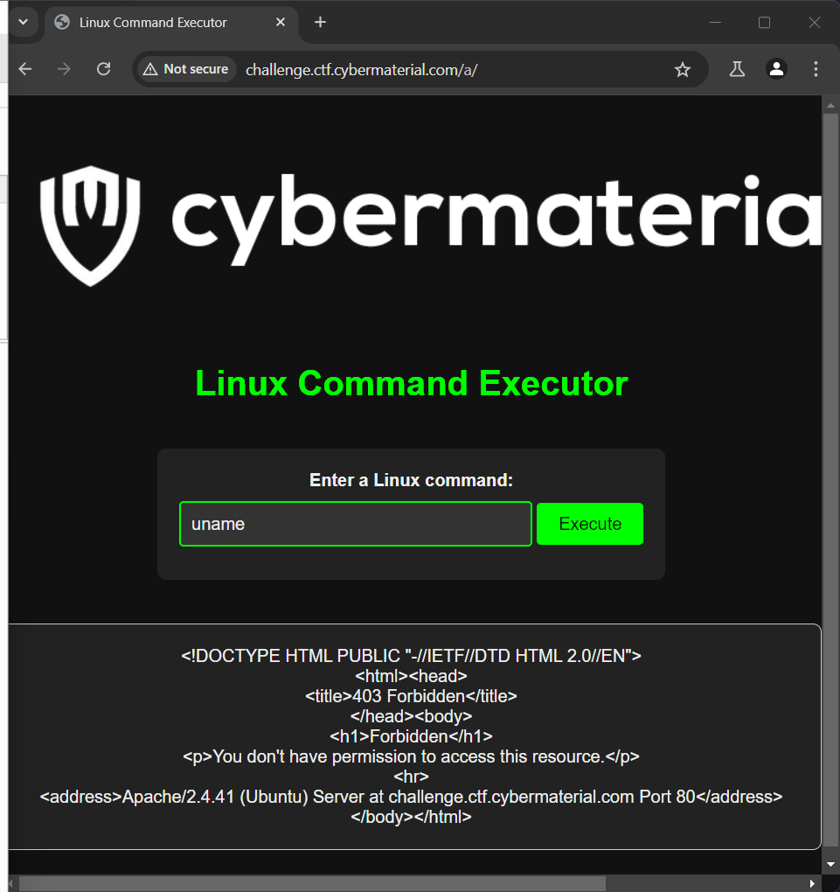

Now we are stuck, but seeing the error properly, we can understand that we are not in proper directory
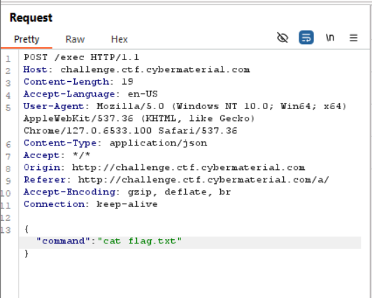
we should put a request to `/a/exec` and not `/exec`
Doing this we get the flag
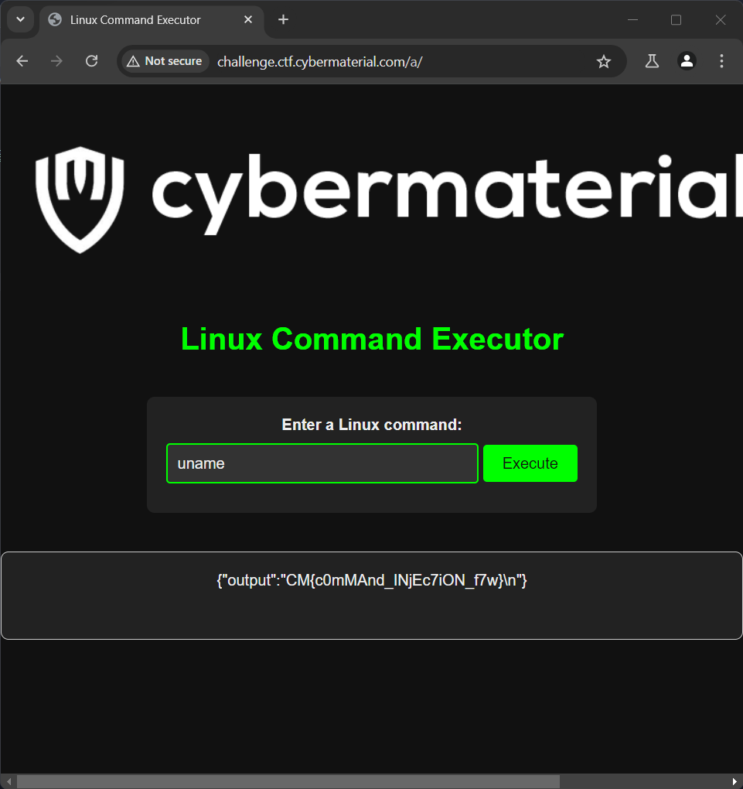 
#### Flag: CM{c0mMAnd_INjEc7iON_f7w}